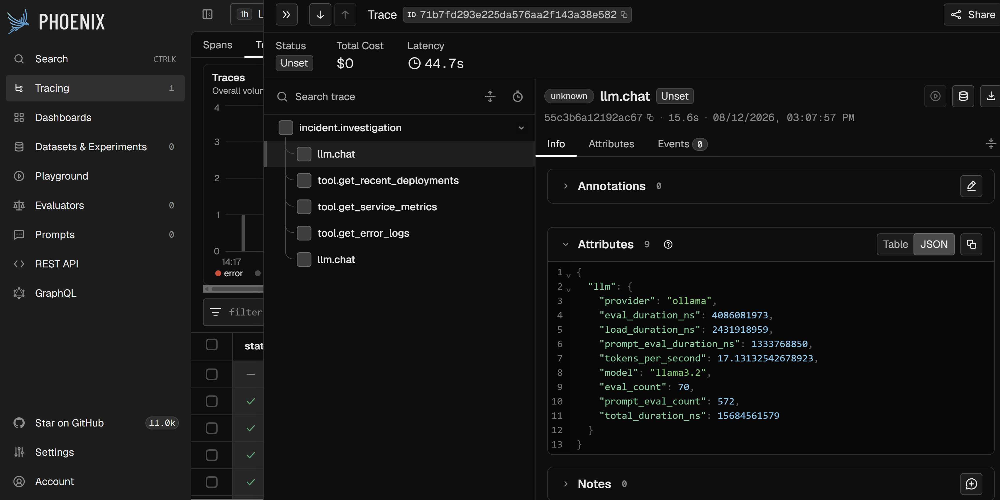

# AI Incident Investigator

An experimental AI-powered incident investigation system built to explore how Large Language Models, tool calling, operational evidence, and LLM observability can be combined into an SRE investigation workflow.

The project runs locally using Ollama and Llama 3.2, with synthetic incident data representing application logs, service metrics, and recent deployments. OpenTelemetry is used to instrument the investigation and send telemetry to Arize Phoenix for observability.

## Why This Project?

Incident investigation often requires an engineer to correlate information across multiple sources such as:

- Application logs
- Service metrics
- Recent deployments
- Traces
- Infrastructure events
- Historical incidents

This project explores whether an AI agent can assist with that investigation by selecting the appropriate evidence sources, correlating the returned information, and producing a structured investigation report.

The goal is not to replace an SRE. Instead, the project explores how an AI system could act as an investigation assistant while keeping the underlying evidence and investigation process observable.

## Architecture


                         ┌─────────────────────┐
                         │   Synthetic Incident │
                         │       INC-001        │
                         └──────────┬──────────┘
                                    │
                                    ▼
                         ┌─────────────────────┐
                         │   AI Investigator   │
                         │                     │
                         │  Llama 3.2 / Ollama │
                         └──────────┬──────────┘
                                    │
                              Tool Calling
                                    │
              ┌─────────────────────┼─────────────────────┐
              │                     │                     │
              ▼                     ▼                     ▼
       ┌─────────────┐       ┌─────────────┐       ┌───────────────┐
       │    Logs     │       │   Metrics   │       │  Deployments  │
       │    JSON     │       │    JSON     │       │     JSON      │
       └─────────────┘       └─────────────┘       └───────────────┘
              │                     │                     │
              └─────────────────────┼─────────────────────┘
                                    │
                                    ▼
                         ┌─────────────────────┐
                         │ Investigation Report│
                         │                     │
                         │ • Summary           │
                         │ • Root Cause        │
                         │ • Evidence          │
                         │ • Alternatives      │
                         │ • Next Steps        │
                         └─────────────────────┘


       Investigation Telemetry
                │
                ▼
       ┌──────────────────┐
       │  OpenTelemetry   │
       └────────┬─────────┘
                │
                ▼
       ┌──────────────────┐
       │  Arize Phoenix   │
       │                  │
       │ • LLM calls      │
       │ • Tool calls     │
       │ • Latency        │
       │ • Token metrics  │
       └──────────────────┘


## Prerequisites

You will need:

Git
Python 3.12+
Docker Desktop or Docker Engine
Docker Compose

The project runs Ollama through Docker, so a host-level Ollama installation is not required.

## Setup

Clone the repository:

git clone <YOUR-GITHUB-REPOSITORY>
cd ai-incident-investigator

Create a Python virtual environment:

python3 -m venv .venv

## Activate it:

Linux / macOS
source .venv/bin/activate
Windows
.venv\Scripts\Activate.ps1

## Install the Python dependencies:

pip install -r requirements.txt

## Start Ollama and Phoenix:

docker compose up -d

## Verify the containers:

docker ps

The expected services are:

ai-investigator-ollama
ai-investigator-phoenix

## Pull the Llama 3.2 model into the Ollama container:

docker exec -it ai-investigator-ollama ollama pull llama3.2
Running an Investigation

Run an incident using its incident ID:

python -m app.main INC-001

Or:

python -m app.main INC-002

The investigator will load the corresponding incident and allow the LLM to gather evidence through the available tools.

A final investigation report will be printed to the terminal.

## Viewing Phoenix

Phoenix is available locally at:

http://localhost:6006

After running an investigation, open Phoenix and inspect the generated traces.

You should see spans representing the investigation and LLM/tool activity.

Examples include:

incident.investigation
    ├── llm.chat
    ├── tool.get_error_logs
    ├── llm.chat
    ├── tool.get_service_metrics
    ├── llm.chat
    └── tool.get_recent_deployments

The exact number of LLM and tool calls can vary depending on how the model approaches the investigation.

## Running Tests

Run the test suite with:

python -m pytest

The current project includes tests covering the investigation tools.

## Adding Synthetic Incidents

Additional incidents can be added by creating matching files under:

data/
├── incidents/
├── logs/
├── metrics/
└── deployments/

For example:

INC-003.json

should exist in each relevant directory.

This allows the project to simulate different incident scenarios and investigate how the agent responds to different combinations of operational evidence.

## Current Limitations

This project is intentionally a local experimental implementation.

Current limitations include:

Synthetic operational data
Local LLM execution
Limited investigation tools
No production infrastructure integrations
No persistent incident history
No automated remediation
No authentication or authorization layer
Investigation accuracy depends on the underlying LLM

The project should not be considered a production incident response system.

## Future Work

Potential future development includes:

Additional synthetic incident scenarios
More investigation tools
Distributed tracing evidence
Kubernetes investigation capabilities
Integration with real observability backends
More advanced evidence correlation
Investigation evaluation and scoring
Improved report generation
Agent performance analysis
Additional Phoenix instrumentation
Investigation replay and comparison
Article Series

This repository accompanies a series exploring the design and development of the AI Incident Investigator.

## Part 1

[Building an AI Incident Investigator](https://marcoaguilera.dev/posts/building-an-ai-incident-investigator/)

Additional articles will be added as the project evolves.



## Disclaimer

This project is an experimental engineering project intended for learning, experimentation, and demonstration.

All incident data included in the repository is synthetic and does not represent real production incidents or operational data.


```text
